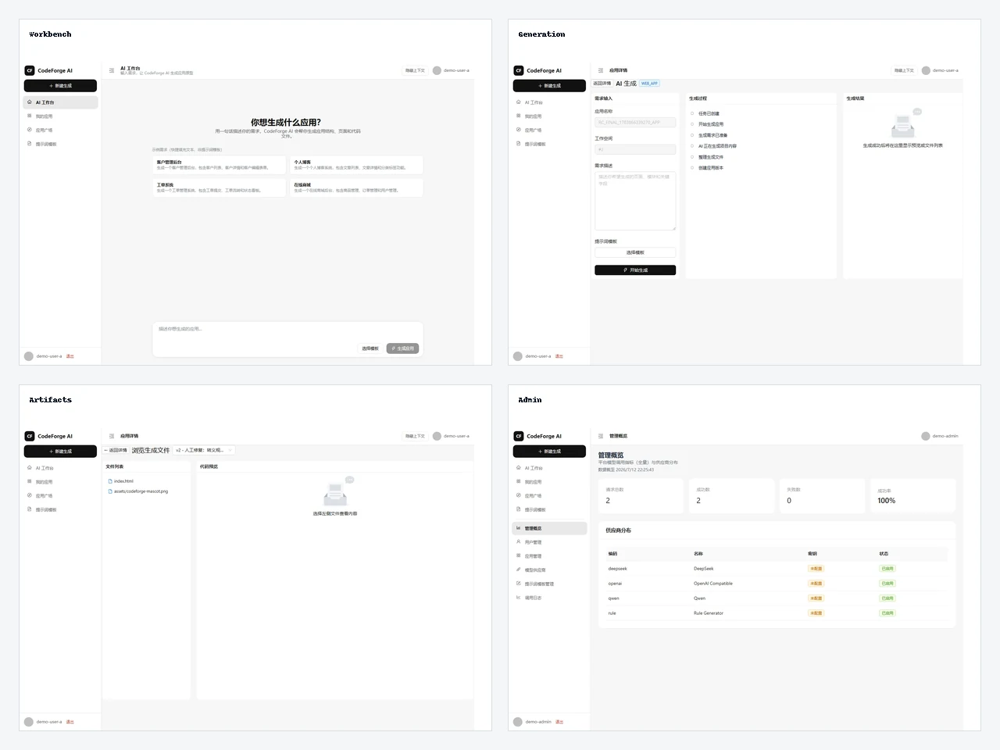
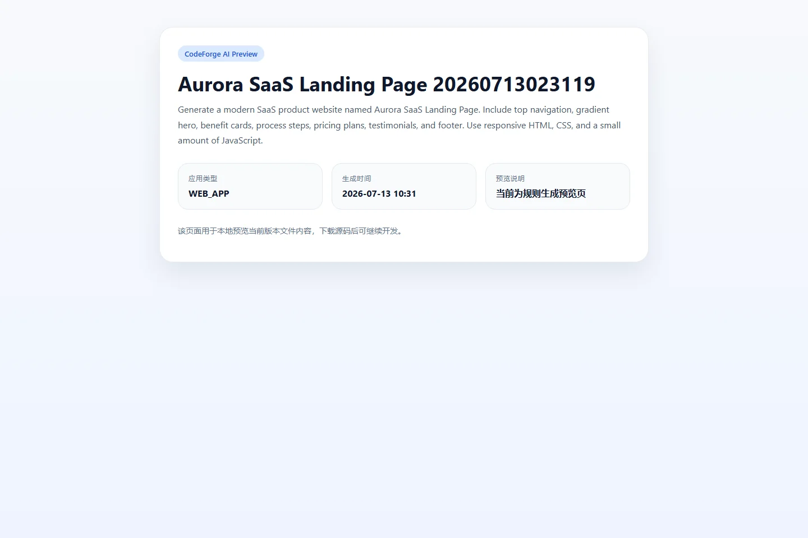
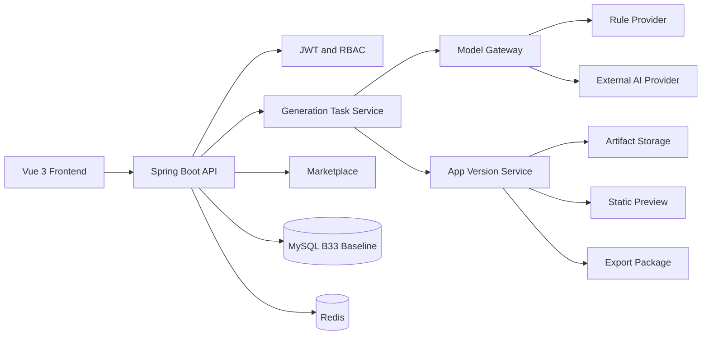
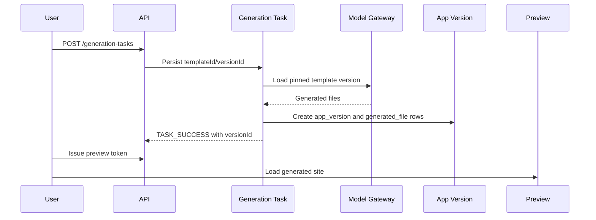

# CodeForge AI

[中文](README.md)



## Product Overview

CodeForge AI is a secure and auditable AI application generation and release platform. It connects prompt template versions, model routing, generation tasks, app versions, generated files, repair versions, export packages, marketplace publication, and admin audit into one traceable lifecycle.

## Generated Website Preview



This screenshot is produced by the real `generation_task -> app_version -> generated_file -> preview token` chain. The release screenshot script registers demo users through the API, creates an app, runs generation with `CODEFORGE_FORCE_RULE_ONLY=false` and `AI_PROVIDER=deepseek`, requires `generationSource=AI_DIRECT`, `fallbackUsed=false`, and `providerCode=deepseek` from the success event, resolves the `versionId`, and loads the formal preview endpoint.

## Core Capabilities

- Prompt version pinning for generation requests, async execution, retries, and audit traces.
- Rule Mode for deterministic local validation without provider keys.
- AI_DIRECT and routing policies for real provider execution.
- App versions, generated files, repair versions, preview tokens, export packages, and marketplace publication.
- Admin views for users, provider routing, prompt templates, model calls, and audit logs.

## Role Matrix

| Role | Access |
| --- | --- |
| Anonymous | Public marketplace and public previews only |
| User | Own workspaces, apps, generation tasks, previews, exports |
| Editor | Authorized workspace and app maintenance |
| PLATFORM_ADMIN | Provider, prompt, user, audit, and metrics administration |

## Architecture



See [docs/architecture.md](docs/architecture.md).

## Generation Flow



## Security Model

Private reads enforce owner, workspace, app, version, and package binding. Preview tokens bind to versions rather than storage paths. Export and repair paths are normalized and checked against their roots. Audit logs exclude tokens, secrets, complete prompts, and local storage paths. Security vulnerabilities must be reported privately through GitHub Security Advisories.

## Quick Start

```powershell
git clone https://github.com/18307519324az/CodeForge-AI.git
cd CodeForge-AI
Copy-Item .env.example .env.local
docker compose up -d mysql redis
powershell -File .\scripts\db\bootstrap-fresh-database.ps1 -EnvFile .env.local -ConfirmCreate
powershell -File .\scripts\dev-start.ps1 -Profile local -EnvFile .env.local -BackendPort 8150 -FrontendPort 5182
```

Open `http://127.0.0.1:5182`. The first registered user in a fresh database receives `PLATFORM_ADMIN`.

## Fresh Database Bootstrap

Fresh MySQL initialization uses `scripts/db/bootstrap-fresh-database.ps1` and the B33 baseline migration. Expected output includes:

```text
B33_BASELINE_APPLIED
FLYWAY_VALIDATE_PASS
SCHEMA_STATUS=READY
```

`scripts/db/apply-local-migrations.ps1` is an `EXPERIMENTAL_LEGACY_RECOVERY` tool for manually reviewed historical local databases. It is not the fresh bootstrap path.

## Provider Configuration

For local demos:

```dotenv
CODEFORGE_FORCE_RULE_ONLY=true
AI_PROVIDER=rule
```

For real model calls, set `CODEFORGE_FORCE_RULE_ONLY=false`, choose `AI_PROVIDER`, and configure the matching provider key in `.env.local`.

## Tests

```powershell
mvn test
Push-Location frontend
npm ci
npm run type-check
npm run test
npm run build
Pop-Location
node --test scripts/release/**/*.test.mjs
powershell -File scripts/db/bootstrap-fresh-database.Tests.ps1
powershell -File scripts/db/check-local-schema.Tests.ps1
bash scripts/check-compliance.sh
```

## Project Layout

| Path | Purpose |
| --- | --- |
| `src/main/java` | Spring Boot backend |
| `frontend` | Vue 3 frontend |
| `sql/mysql-baseline` | Fresh MySQL B33 baseline |
| `scripts/db` | Database bootstrap and schema gates |
| `scripts/release` | Release screenshot and documentation gates |
| `docs` | Architecture, product tour, deployment, troubleshooting, security |

## Known Limitations

- Docker Compose is infrastructure-only.
- No hosted public demo is included.
- AI_DIRECT requires a configured provider key.
- Rule Mode is deterministic and does not represent provider output quality.

## Roadmap

- Export package signing.
- Marketplace review workflow.
- More provider runtime metrics.
- Optional production deployment reference.

## License

MIT License. See [LICENSE](LICENSE).

## Maintainer

18307519324az
