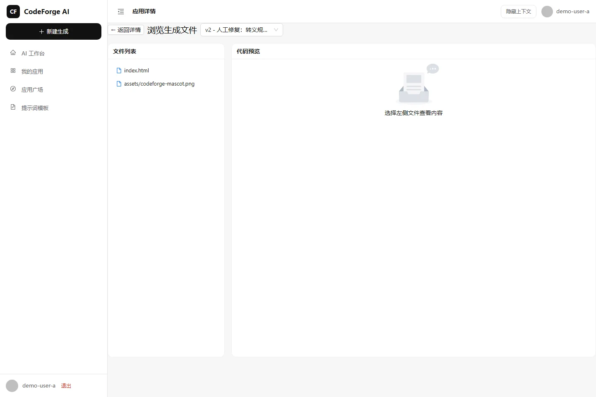
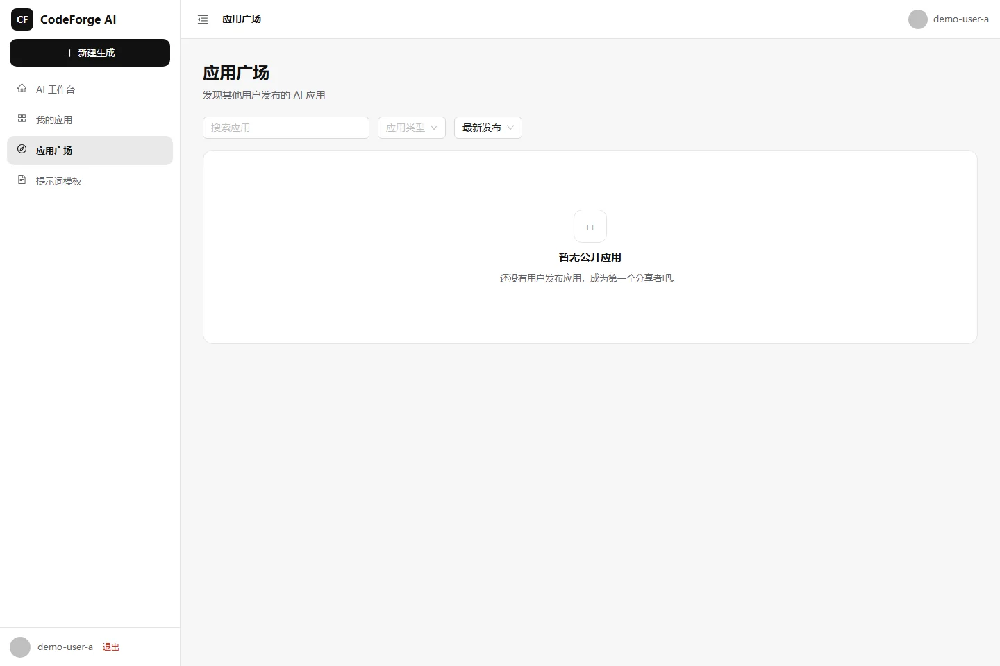
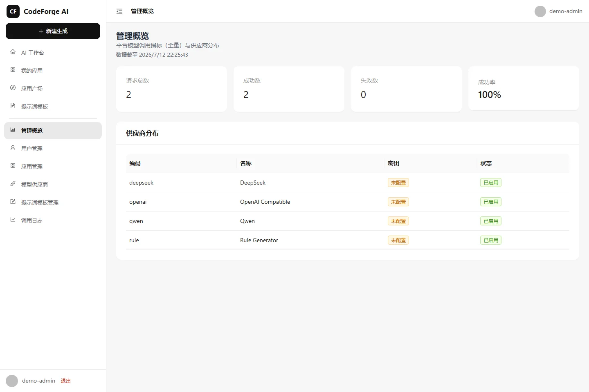
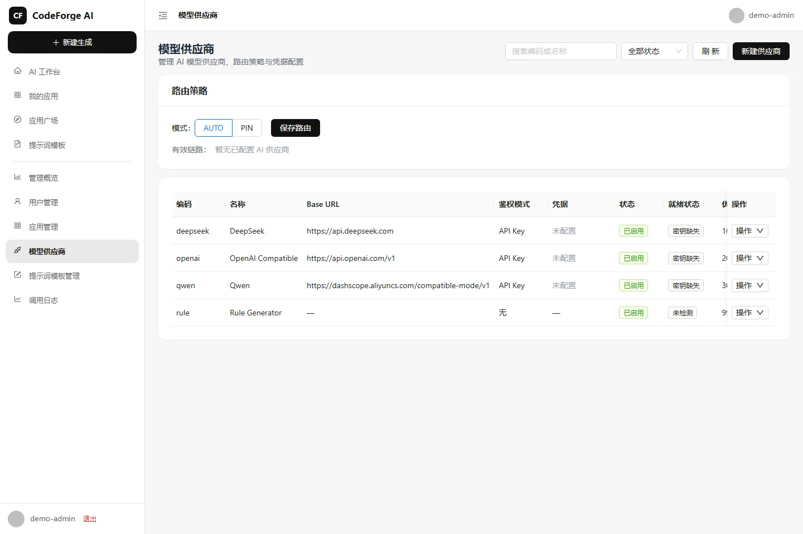
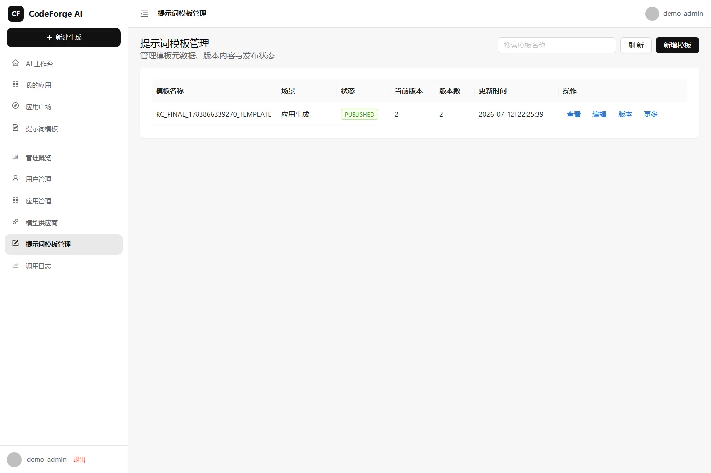
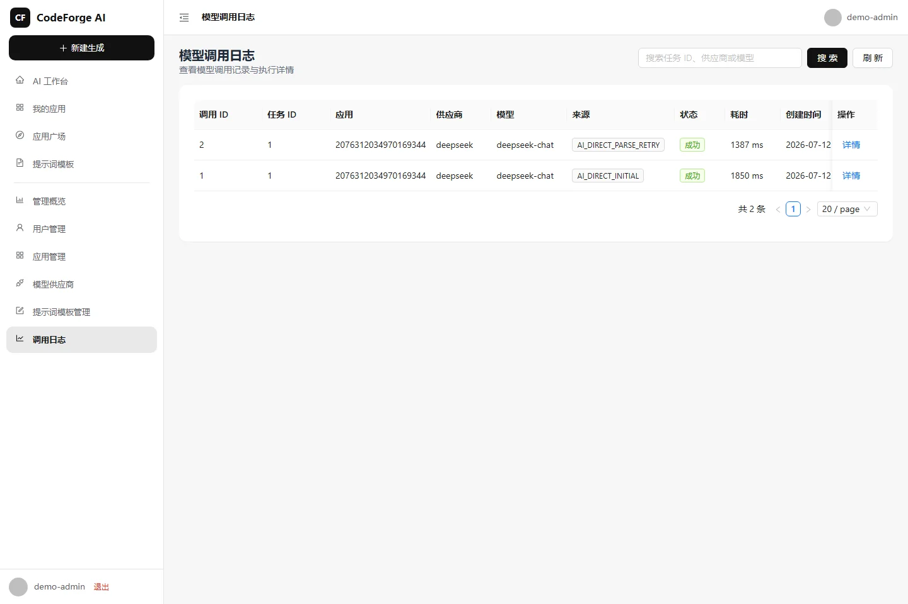
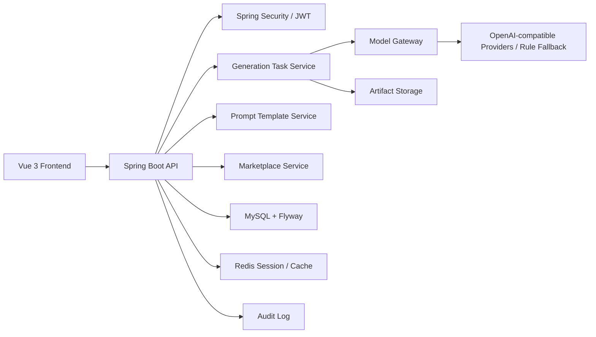
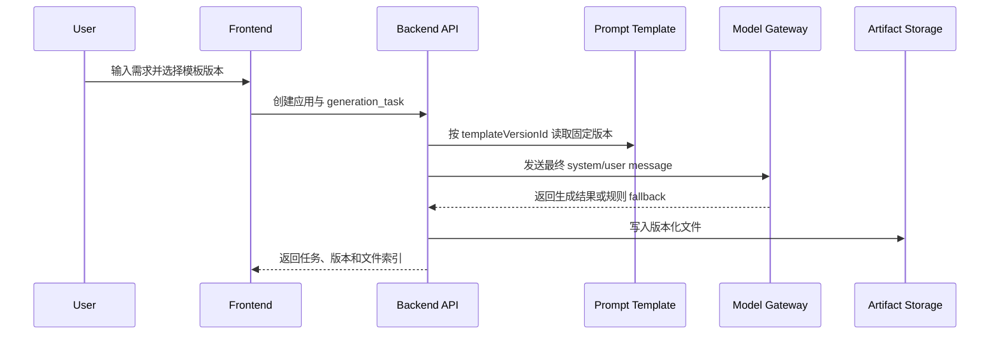

# CodeForge AI

[English](README.en.md)

<p align="center">
  
</p>

<h3 align="center">安全、可审计的 AI 应用生成与发布平台</h3>
<p align="center">Versioned prompts. Governed model calls. Traceable artifacts. Marketplace-ready delivery.</p>

<p align="center">
  <a href="https://github.com/18307519324az/CodeForge-AI/actions/workflows/ci.yml"></a>
  <a href="https://github.com/18307519324az/CodeForge-AI/releases/tag/v1.0.0"></a>
  
  
  <a href="LICENSE"></a>
</p>


## 概览

CodeForge AI 是一个面向应用生成、产物管理和发布流转的全栈平台。它把账号权限、提示词模板版本、模型调用治理、生成任务、静态预览、源码导出、市场发布和管理审计串成一条可追踪链路，适合本地部署、二次开发和安全评审。

本仓库公开的是完整工程源码，不包含真实用户数据、真实模型密钥或生产凭据。

## 在线预览说明

当前版本不提供公开托管演示站。请按“快速开始”在本地启动 MySQL、Redis、后端和前端后体验完整流程。

## 产品截图

| 工作台 | 生成工作台 |
| --- | --- |
|  |  |

| 产物预览 | 应用广场 |
| --- | --- |
|  |  |

| 管理概览 | 模型路由 |
| --- | --- |
|  |  |

| 提示词版本 | 模型调用审计 |
| --- | --- |
|  |  |

## 核心能力

- 对话式生成：用自然语言创建应用，生成任务异步执行，并保留事件流与任务状态。
- 提示词模板版本：生成请求显式绑定模板版本，任务和模型调用日志保留模板身份。
- 模型调用治理：支持多供应商配置、路由策略、调用日志、预算门禁和错误脱敏。
- 产物生命周期：生成文件、版本快照、静态预览、修复版本和导出包均可追溯。
- 市场发布：发布条目绑定固定应用版本，预览和下载入口执行权限与状态校验。
- 管理审计：管理员可查看用户、应用、模型供应商、模型调用和审计日志。

## 角色矩阵

| 能力 | 匿名用户 | 普通用户 | 应用 Owner/Editor | 平台管理员 |
| --- | --- | --- | --- | --- |
| 登录与注册 | 可访问 | 可访问 | 可访问 | 可访问 |
| 创建应用与生成任务 | 不可访问 | 可访问 | 可访问 | 可访问 |
| 查看私有应用 | 不可访问 | 仅本人授权 | 可访问 | 可审计 |
| 修复生成产物 | 不可访问 | 不可访问 | 可访问 | 可审计 |
| 市场浏览 | 可访问公开条目 | 可访问公开条目 | 可发布本人应用 | 可审计 |
| 模型供应商管理 | 不可访问 | 不可访问 | 不可访问 | 可访问 |
| 提示词模板管理 | 不可访问 | 只读已发布模板 | 只读已发布模板 | 可管理 |

## 架构



更多设计见 [docs/architecture.md](docs/architecture.md)。

## 生成链路



## 技术栈

- 后端：Java 21、Spring Boot 3.5、Spring Security、MyBatis-Flex、Flyway、MySQL、Redis。
- 前端：Vue 3、Vite、TypeScript、Pinia、Ant Design Vue、Vitest、Playwright。
- 工程：Maven Wrapper、npm、Docker Compose、PowerShell、GitHub Actions。

## 安全设计

- 权限边界：应用、版本、导出包和市场发布逐级绑定，普通用户不能通过直接对象引用访问他人资源。
- Prompt 安全：普通 API 不返回完整系统 Prompt；模型调用日志保存模板身份和指纹，不保存明文 Prompt。
- 路径安全：生成产物和修复文件执行 segment 校验、规范化根目录边界和符号链接逃逸检查。
- 发布安全：公开预览、详情和下载均按固定发布版本读取，并检查 archived/unpublished 状态。
- 凭据安全：供应商密钥通过环境变量或加密数据库来源管理，示例文件只保留占位值。

更多说明见 [docs/security-model.md](docs/security-model.md)。

## 快速开始

### 1. 准备依赖

- JDK 21
- Node.js 20 或更高版本
- npm
- MySQL 8.0
- Redis 7
- PowerShell 7 或 Windows PowerShell

### 2. 启动基础设施

`docker-compose.yml` 只启动 MySQL 和 Redis，不构建或启动后端、前端。

```powershell
docker compose up -d mysql redis
```

### 3. 配置环境变量

复制 `.env.example`，按本地环境填入数据库、Redis、JWT 和模型供应商配置。不要提交真实密钥。

```powershell
Copy-Item .env.example .env.local
$env:DB_HOST = '127.0.0.1'
$env:DB_PORT = '3306'
$env:DB_NAME = 'codeforge_ai'
$env:DB_USERNAME = 'codeforge_ai_user'
$env:DB_PASSWORD = '<your-db-password>'
$env:JWT_SECRET = '<at-least-32-characters>'
```

### 4. 初始化或核验数据库

本地 schema gate 会识别 B33 基线历史或 V33 版本历史。

```powershell
powershell -File .\scripts\db\check-local-schema.ps1
```

若全新库返回 `MISSING`，使用已提交的本地迁移辅助脚本补齐当前 V33 所需对象：

```powershell
powershell -File .\scripts\db\apply-local-migrations.ps1
powershell -File .\scripts\db\check-local-schema.ps1
```

若返回 `HISTORY_MISMATCH`，不要执行 `flyway repair` 或手工改 checksum；先阅读 [docs/troubleshooting.md](docs/troubleshooting.md)。

### 5. 启动应用

```powershell
powershell -File .\scripts\dev-start.ps1 -Profile local -BackendPort 8150 -FrontendPort 5182
```

访问前端：`http://127.0.0.1:5182`

后端 API：`http://127.0.0.1:8150/api`

## Provider 配置

平台支持规则生成 fallback 和 OpenAI-compatible Provider。推荐通过环境变量注入密钥：

| 变量 | 用途 |
| --- | --- |
| `AI_PROVIDER` | `auto`、`openai`、`deepseek`、`qwen` 或 `rule` |
| `OPENAI_API_KEY` | OpenAI-compatible Provider 密钥 |
| `DEEPSEEK_API_KEY` | DeepSeek Provider 密钥 |
| `CODEFORGE_FORCE_RULE_ONLY` | 本地测试时强制规则生成，不调用真实模型 |
| `CODEFORGE_CREDENTIAL_MASTER_KEY` | 加密数据库凭据所需主密钥 |

完整配置见 [docs/configuration.md](docs/configuration.md)。

## 测试与质量门禁

```powershell
mvn test
Push-Location frontend
npm ci
npm run type-check
npm run test
npm run build
Pop-Location
node --test scripts/release/**/*.test.mjs
git diff --check
```

发布素材可执行：

```powershell
node scripts/release/readme-assets.test.mjs
```

截图脚本需要正在运行的本地前后端和演示账号环境变量：

```powershell
node scripts/release/capture-readme-screenshots.mjs
```

## 项目结构

```text
src/                         Spring Boot 后端源码
frontend/                    Vue 3 前端应用
sql/                         MySQL/H2 migration 与 B33 baseline
scripts/                     本地启动、数据库检查和发布验证脚本
scripts/release/             发布门禁、截图和 README 资产校验
docker-compose.yml           MySQL 与 Redis 基础设施
docs/                        架构、配置、部署、安全和产品说明
docs/images/                 README 截图与社交预览图
```

## 已知限制

- 当前仓库不包含生产级对象存储、Nginx 和完整容器镜像编排。
- 本地 `dev-start.ps1` 负责启动开发后端与 Vite 前端，不是生产进程管理器。
- 真实模型调用需要自行配置 Provider 密钥；默认建议使用规则 fallback 完成开发验证。
- GitHub Social Preview 需要仓库维护者在 GitHub 页面上传 `docs/images/social-preview.png`。

## 路线图

- 完整 Docker 镜像与反向代理部署模板。
- Provider 健康检查和路由观测面板增强。
- 产物差异对比与版本回滚工作台。
- 更细粒度的团队协作权限模型。

## 贡献

请阅读 [CONTRIBUTING.md](CONTRIBUTING.md)。提交前必须运行测试与发布素材校验，并确保没有真实密钥、令牌、用户数据或本机绝对路径进入提交。

## 许可证

本项目使用 MIT License。详见 [LICENSE](LICENSE)。

## 作者

维护者：[@18307519324az](https://github.com/18307519324az)
