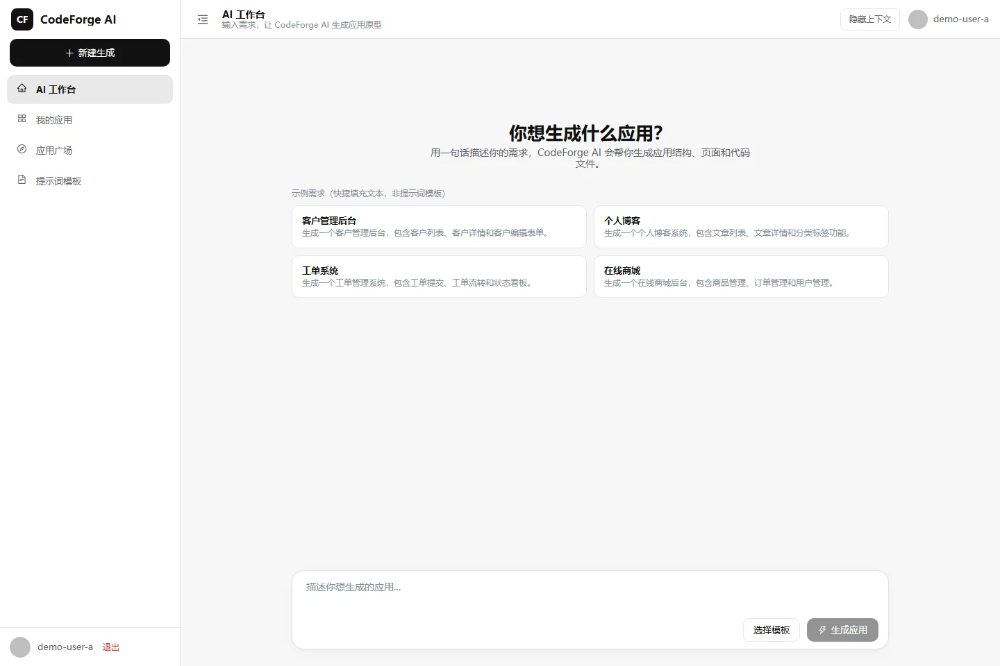
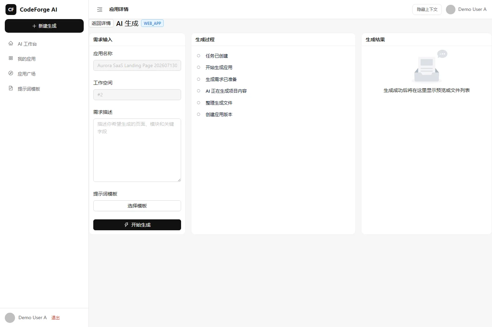
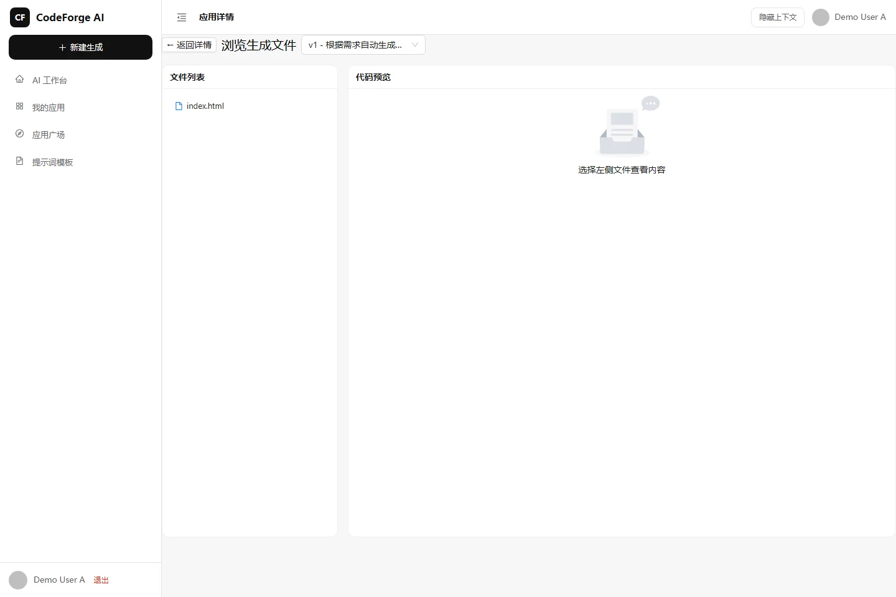
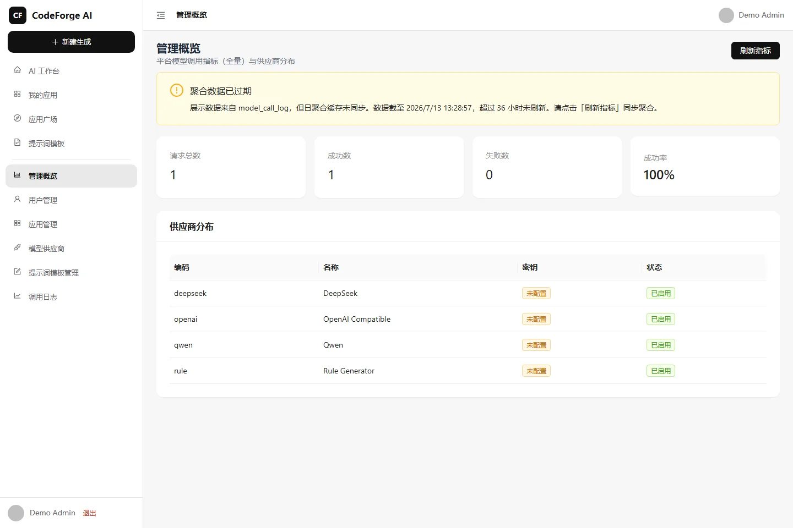
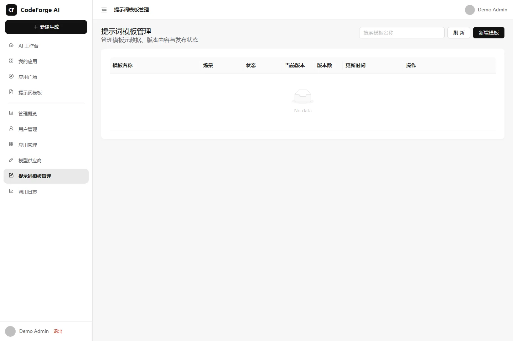
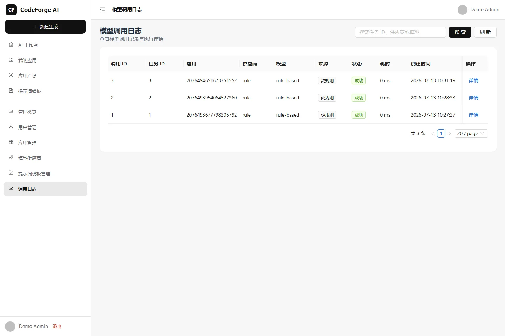
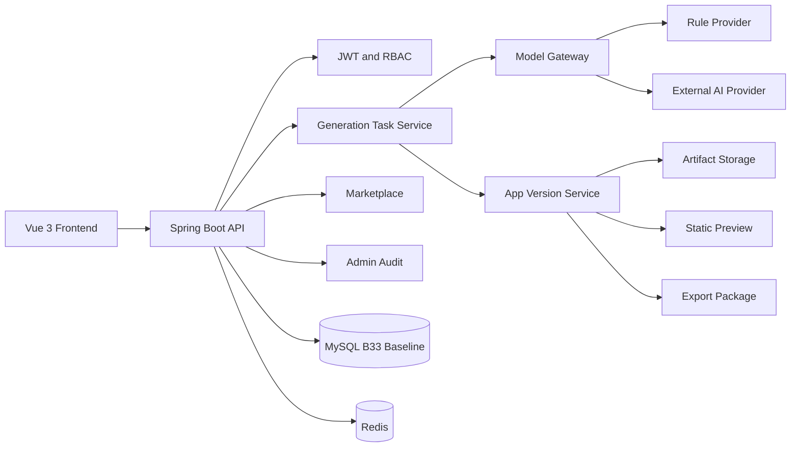
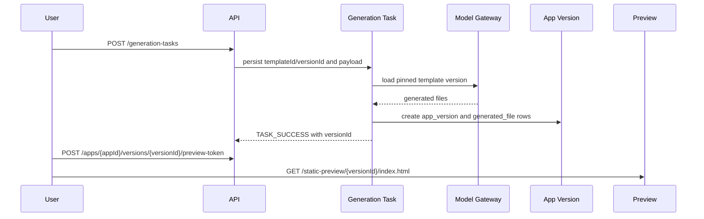

# CodeForge AI

[English](README.en.md)


[](https://github.com/18307519324az/CodeForge-AI/releases)
[](https://github.com/18307519324az/CodeForge-AI/actions)
[](LICENSE)

CodeForge AI 是一个安全、可审计的 AI 应用生成与发布平台。它把提示词模板、模型路由、生成任务、应用版本、产物文件、修复版本、导出包、市场发布和管理审计放在同一条可追溯链路中。

## 产品概览

平台支持两种运行路径：

| 模式 | 用途 | Provider Key |
| --- | --- | --- |
| Rule Mode | 本地演示、CI、确定性验收 | 不需要 |
| AI_DIRECT | 连接真实模型生成应用 | 需要 |

Fresh MySQL 使用 `B33__codeforge_mysql_schema.sql` 作为 Baseline Migration。全新数据库不会执行 V1 迁移；已存在的历史库继续由 Flyway history 约束，不通过校验时需要人工调查。

## 真实生成网站预览

下图来自真实 `generation_task -> app_version -> generated_file -> preview token` 链路。截图脚本通过 API 注册 demo 用户、创建应用、在 `CODEFORGE_FORCE_RULE_ONLY=false` 且 `AI_PROVIDER=deepseek` 的运行时发起生成任务，强制校验成功事件中的 `generationSource=AI_DIRECT`、`fallbackUsed=false` 和 `providerCode=deepseek`，解析 `versionId` 后再通过正式预览入口加载页面。


这不是手写 mock 页面，也不是文件浏览页截图。预览不会暴露服务端 storage path。

## 截图

| 工作台 | 生成任务 |
| --- | --- |
|  |  |

| 产物浏览 | 应用市场 |
| --- | --- |
|  |  |

| 管理概览 | 模型路由 |
| --- | --- |
|  |  |

| 提示词版本 | 模型调用审计 |
| --- | --- |
|  |  |

## 核心能力

- Prompt Template V1/V2：生成请求显式绑定模板版本，异步执行和重试保持固定版本。
- Model Gateway：支持 Rule Mode、AUTO、PIN 和 AI_DIRECT 路由。
- Model Call Audit：记录模板身份、调用状态、token、耗时和 prompt fingerprint，不存储完整系统 Prompt。
- App Version：每次生成创建独立应用版本和文件清单。
- Artifact Repair：修复历史产物时创建新版本，不覆盖源版本。
- Static Preview：通过 preview token 加载生成文件，不暴露本地存储路径。
- Export Package：导出包按 app/version/package 绑定并校验路径边界。
- Marketplace：发布条目固定 `versionId`，读取侧检查 archived/unpublished 状态。
- Admin：用户、Provider、Prompt、模型调用和审计日志集中治理。

## 角色矩阵

| 角色 | 能力 |
| --- | --- |
| Anonymous | 访问公开市场页面和公开预览，不能读取私有应用 |
| User | 创建工作区、应用、生成任务、预览和导出自己的产物 |
| Editor | 维护被授权工作区和应用 |
| PLATFORM_ADMIN | 管理 Provider、Prompt Template、用户、审计和系统指标 |

## 架构



更多细节见 [docs/architecture.md](docs/architecture.md)。

## 生成流程



## 安全模型

- 所有私有对象读取都校验 owner/workspace/app/version/package 绑定。
- Admin 权限只扩大可见性，不绕过对象边界和状态校验。
- Preview token 绑定 version，不接受 storage path。
- 导出包路径执行逐段校验、normalize 和 root boundary 检查。
- 审计日志记录动作和身份，不记录 token、secret、完整 Prompt 或本地路径。
- 未修复安全漏洞只通过 GitHub Private Vulnerability Reporting 报告。

## 快速开始

### 1. Clone

```powershell
git clone https://github.com/18307519324az/CodeForge-AI.git
cd CodeForge-AI
```

### 2. 复制配置

```powershell
Copy-Item .env.example .env.local
```

`.env.local` 已被 `.gitignore` 忽略。

### 3. 修改必需配置

必须修改：

- `MYSQL_ROOT_PASSWORD`
- `MYSQL_PASSWORD`
- `DB_PASSWORD`
- `JWT_SECRET`
- `CODEFORGE_CREDENTIAL_MASTER_KEY`

无真实模型 Key 时：

```dotenv
CODEFORGE_FORCE_RULE_ONLY=true
AI_PROVIDER=rule
```

使用真实模型时：

```dotenv
CODEFORGE_FORCE_RULE_ONLY=false
AI_PROVIDER=auto
```

并配置对应 Provider Key。

### 4. 启动基础设施

```powershell
docker compose up -d mysql redis
```

### 5. Fresh Database Bootstrap

```powershell
powershell -File .\scripts\db\bootstrap-fresh-database.ps1 `
  -EnvFile .env.local `
  -ConfirmCreate
```

期望输出包含：

```text
B33_BASELINE_APPLIED
FLYWAY_VALIDATE_PASS
SCHEMA_STATUS=READY
```

第二次运行已初始化数据库时输出：

```text
ALREADY_READY
SCHEMA_STATUS=READY
```

`scripts/db/apply-local-migrations.ps1` 仅用于人工确认后的 `EXPERIMENTAL_LEGACY_RECOVERY`，不是 Fresh DB 初始化入口。

### 6. 启动应用

```powershell
powershell -File .\scripts\dev-start.ps1 `
  -Profile local `
  -EnvFile .env.local `
  -BackendPort 8150 `
  -FrontendPort 5182
```

访问：

- Frontend: http://127.0.0.1:5182
- Health: http://127.0.0.1:8150/api/actuator/health

全新数据库中的第一个注册用户会获得 `PLATFORM_ADMIN`。

## Provider 配置

本地演示推荐 Rule Mode。真实模型需要在 `.env.local` 配置 Provider Key，并通过管理端 Provider Routing 控制 AUTO/PIN 策略。不要把真实 Key 写入代码、日志、Issue、截图或提交。

## 测试

```powershell
mvn test

Push-Location frontend
npm ci
npm run type-check
npm run test
npm run build
Pop-Location

node --test scripts/release/**/*.test.mjs
powershell -File scripts/db/bootstrap-fresh-database.Tests.ps1
powershell -File scripts/db/check-local-schema.Tests.ps1
bash scripts/check-compliance.sh
```

## 项目结构

| 路径 | 说明 |
| --- | --- |
| `src/main/java` | Spring Boot API、应用服务、领域模型、持久化 |
| `frontend` | Vue 3 前端 |
| `sql/migrations` | 通用迁移 |
| `sql/mysql-local` | MySQL 正式增量迁移 |
| `sql/mysql-baseline` | Fresh MySQL B33 Baseline |
| `scripts/db` | schema gate、fresh bootstrap、legacy recovery |
| `scripts/release` | 发布截图与文档 gate |
| `docs` | 架构、产品导览、部署、排障和安全模型 |

## 已知限制

- Docker Compose 只提供 MySQL 与 Redis 基础设施，本地后端和前端仍由脚本启动。
- 仓库不提供公开托管 demo。
- AI_DIRECT 需要用户自行配置 Provider Key。
- Rule Mode 用于确定性本地演示，不代表真实模型输出质量。

## 路线图

- 增强导出包签名与校验。
- 扩展 Marketplace 审核流。
- 增加更多 Provider 运行时指标。
- 提供可选的生产部署参考。

## 许可证

MIT License，见 [LICENSE](LICENSE)。

## 维护者

18307519324az
