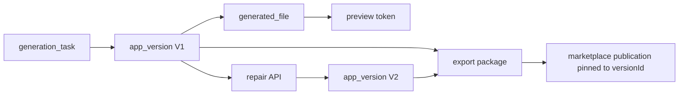
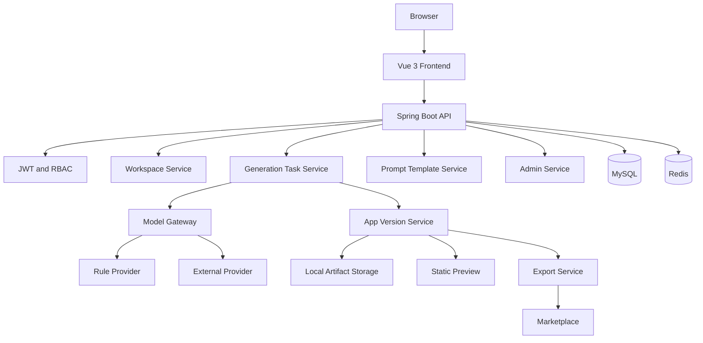
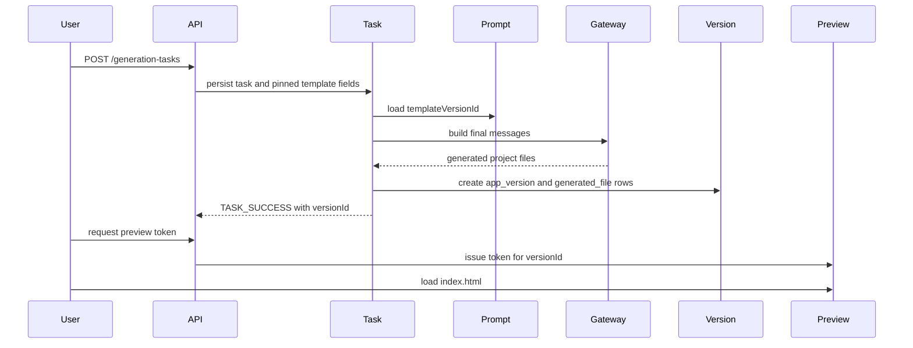
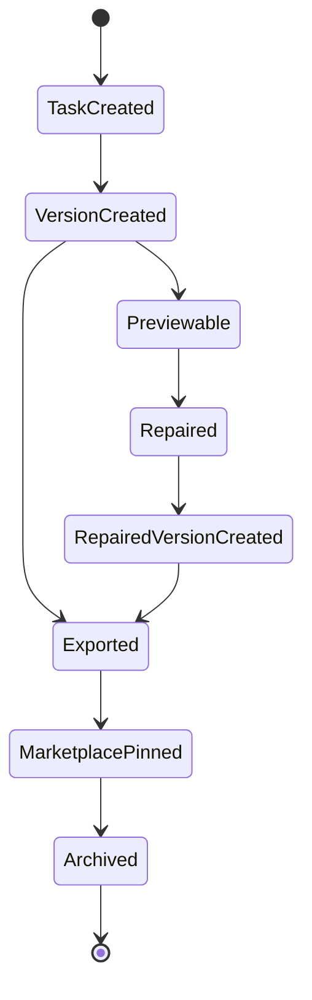

# Architecture

CodeForge AI is organized around a traceable application generation lifecycle.

## 1. Frontend

Vue 3 renders the workbench, generation flow, artifact browser, marketplace, prompt template management, provider routing, model call audit, and admin dashboards.

## 2. API Layer

Spring Boot controllers expose `/api/v1` endpoints. Controllers keep request validation and delegate ownership, status, and lifecycle rules to application services.

## 3. Authentication and RBAC

JWT authentication resolves `CurrentUser`. Object reads still check owner/workspace/app/version binding even when the user is `PLATFORM_ADMIN`.

## 4. Workspaces and Apps

Workspaces scope application ownership. Apps hold display state, publication state, and `currentVersionId`.

## 5. Generation Task

`generation_task` stores independent `prompt_template_id` and `prompt_template_version_id` fields. `requestPayloadJson` is payload evidence, not the only source of truth.

## 6. Prompt Template Version Binding

Generation requests bind a concrete template version. Async dispatch, retry, compact, JSON repair, and fingerprint logic use that fixed version instead of latest fallback.

## 7. Model Gateway

The gateway builds final outgoing model messages. Rule Mode generates deterministic local artifacts. AI_DIRECT routes to configured providers when enabled.

## 8. Model Call Log

Model calls record provider, model, status, token counts, template identity, and prompt fingerprints. Complete prompts and secrets are not persisted for ordinary API exposure.

## 9. Artifact Generation

The generation facade creates app versions and generated file rows after model or rule output is parsed and validated.

## 10. Artifact Lifecycle

## 11. Repair New Version Semantics

Repair creates a new version and keeps the source version unchanged. File paths are validated segment by segment and resolved inside the version root.

## 12. Preview Token

Preview access is token-bound to the requested `versionId`. The token authorizes static preview file reads without revealing storage paths.

## 13. Export Package

Export packages bind marketplace, app, version, and package IDs. Download paths are normalized and constrained to the version root.

## 14. Marketplace Pinned Version

Publication records pin `versionId`. Preview, detail, and download paths use the same pinned version and re-check archived/unpublished state on read.

## 15. Admin Metrics

Admin pages aggregate users, apps, providers, prompt templates, model calls, and audit logs without exposing provider keys or full prompts.

## 16. Database Migration and B33 Baseline

Fresh MySQL uses `B33__codeforge_mysql_schema.sql` as the baseline migration. Incremental `V1` through `V34` remain immutable history for existing databases and tests.

## 17. Local Deployment Boundary

Docker Compose provides MySQL and Redis. Backend and frontend run as local processes through `scripts/dev-start.ps1`.

## 18. Known Architecture Limits

No hosted public demo is included. Production deployment hardening, external object storage policy, and package signing are future work.

## Component Diagram

## Generation Sequence Diagram

## Artifact Lifecycle Diagram

