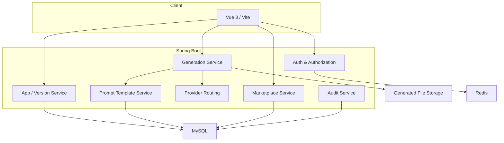

# 架构说明

CodeForge AI 采用前后端分离架构。前端负责工作台、管理台、应用广场和产物浏览；后端负责认证授权、应用生成、Prompt 模板、模型供应商、产物存储、导出包、市场发布和审计。

## 核心链路

1. 用户登录后创建应用或从工作台提交生成请求。
2. 生成请求写入 `generation_task`，并持久化模板身份。
3. 后端按固定版本读取 Prompt 模板，构造最终发给 Provider 的消息。
4. 模型调用日志记录 Provider、模板身份、调用状态和 Prompt 指纹。
5. 生成文件写入版本化存储，前端通过应用版本读取文件列表和内容。
6. 发布到市场时，发布条目固定绑定一个应用版本。

## 数据库迁移

- `sql/migrations`：通用历史迁移集合。
- `sql/mysql-local`：MySQL 正式补充迁移。
- `sql/mysql-baseline/B33__codeforge_mysql_schema.sql`：全新 MySQL 环境的 V33 基线 schema。
- `sql/h2-test`：H2/test 专用迁移。
